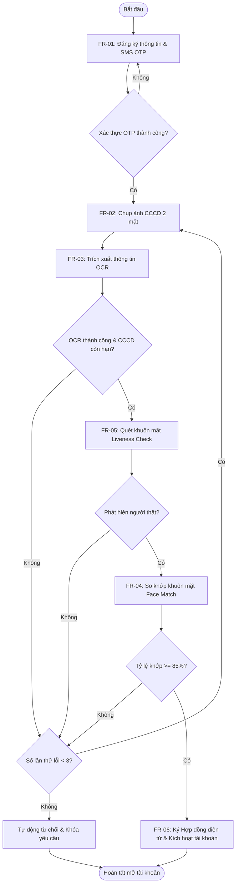

# SOFTWARE REQUIREMENTS SPECIFICATION (SRS) FOR EKYC SYSTEM

---

## 1. Introduction

### 1.1. Purpose
Tài liệu Đặc tả Yêu cầu Phần mềm (SRS) này xác định các yêu cầu chức năng, phi chức năng và kiến trúc hệ thống cho mô-đun định danh điện tử khách hàng (eKYC) của ABC Bank. Tài liệu này được biên soạn theo chuẩn IEEE 830 nhằm phục vụ làm cơ sở cho đội ngũ phát triển, kiểm thử và vận hành hệ thống.

### 1.2. Scope
Hệ thống eKYC cho phép khách hàng mở tài khoản trực tuyến trên ứng dụng Mobile Banking của ABC Bank thông qua các bước: đăng ký tài khoản, tải ảnh giấy tờ tùy thân (CCCD), xử lý nhận dạng ký tự quang học (OCR), chụp ảnh Selfie, xác thực thực thể sống (Liveness Detection), so khớp khuôn mặt (Face Verification) và tự động kích hoạt tài khoản nếu hợp lệ. Hệ thống giới hạn tối đa 3 lần thử lại cho các trường hợp lỗi trước khi tự động từ chối.

### 1.3. Definitions
*   **eKYC (electronic Know Your Customer):** Quy trình định danh và xác thực danh tính khách hàng trực tuyến thông qua các công nghệ sinh trắc học và AI.
*   **OCR (Optical Character Recognition):** Công nghệ nhận dạng ký tự quang học, chuyển đổi hình ảnh chữ viết trên giấy tờ thành văn bản số.
*   **Liveness Detection:** Công nghệ phát hiện thực thể sống, đảm bảo hình ảnh khuôn mặt được cung cấp từ người thật tại thời điểm thực tế, không phải ảnh chụp lại hay video giả mạo.
*   **Face Verification:** Quy trình đối chiếu hình ảnh selfie với ảnh chân dung trên CCCD để kiểm tra độ trùng khớp.
*   **STP (Straight-Through Processing):** Quy trình xử lý tự động xuyên suốt từ đầu đến cuối mà không cần can thiệp thủ công từ con người.

### 1.4. Acronyms
*   **SRS:** Software Requirements Specification
*   **CCCD:** Căn cước công dân
*   **CIF:** Customer Information File (Hồ sơ thông tin khách hàng trên hệ thống ngân hàng)
*   **OTP:** One-Time Password
*   **API:** Application Programming Interface
*   **SDK:** Software Development Kit
*   **NFR:** Non-Functional Requirement
*   **FR:** Functional Requirement

### 1.5. References
*   IEEE Std 830-1998, IEEE Recommended Practice for Software Requirements Specifications.
*   Thông tư số 16/2020/TT-NHNN của Ngân hàng Nhà nước Việt Nam quy định về việc mở và sử dụng tài khoản thanh toán.
*   Nghị định số 13/2023/NĐ-CP về bảo vệ dữ liệu cá nhân (PDPD).

---

## 2. Overall Description

### 2.1. Product Perspective
Hệ thống eKYC là một mô-đun cốt lõi nằm trong hệ sinh thái Ngân hàng số của ABC Bank. Hệ thống giao tiếp trực tiếp với Mobile App (Client), tích hợp với các dịch vụ AI Engine bên ngoài (OCR Engine, Biometrics Engine) và kết nối trực tiếp với hệ thống Core Banking để thực hiện cấp CIF và tài khoản tự động.

### 2.2. Product Functions
*   Đăng ký thông tin tài khoản cơ bản và xác thực số điện thoại qua SMS OTP.
*   Tải lên hình ảnh CCCD mặt trước và mặt sau với các thuật toán kiểm tra chất lượng ảnh đầu vào.
*   Trích xuất dữ liệu tự động từ giấy tờ tùy thân bằng OCR.
*   Thu thập ảnh Selfie và kiểm tra thực thể sống để ngăn chặn gian lận hình ảnh.
*   So sánh khuôn mặt thật với khuôn mặt trên CCCD để đưa ra tỷ lệ khớp.
*   Tự động kích hoạt tài khoản thanh toán và cấp CIF.
*   Xử lý đếm lượt lỗi và tự động khóa/từ chối khi vượt quá giới hạn 3 lần thử lại.

### 2.3. User Classes
*   **Khách hàng cá nhân (End-user):** Người dùng cài đặt ứng dụng di động của ABC Bank thực hiện mở tài khoản trực tuyến từ xa.
*   **Quản trị viên Hệ thống (System Admin):** Cấu hình các tham số ngưỡng điểm so khớp, ngưỡng OCR, quản trị API và theo dõi hệ thống.
*   **Nhân viên Hậu kiểm/Tuân thủ (Compliance/Audit Officer):** Tra cứu logs, xem lại hồ sơ eKYC bị từ chối hoặc các hồ sơ đáng ngờ phục vụ công tác hậu kiểm ngầm.

### 2.4. Operating Environment
*   **Client App:** Chạy trên hệ điều hành Android (phiên bản >= 9.0) và iOS (phiên bản >= 14.0).
*   **Backend Server:** Kiến trúc Microservices chạy trên môi trường Container (Docker/Kubernetes), sử dụng hệ điều hành Linux (CentOS/Ubuntu).
*   **Database:** Hệ quản trị cơ sở dữ liệu quan hệ (PostgreSQL) kết hợp cơ sở dữ liệu NoSQL lưu trữ log sinh trắc học (MongoDB).

### 2.5. Design Constraints
*   **Bảo mật:** Dữ liệu sinh trắc học và ảnh CCCD phải được mã hóa ở mức cơ sở dữ liệu (Database-level encryption).
*   **Mạng:** Yêu cầu kết nối băng thông di động hoặc Wi-Fi tối thiểu 3G để đảm bảo truyền tải dữ liệu đa phương tiện (ảnh/video) không bị gián đoạn.
*   **Pháp lý:** Dữ liệu không được phép lưu trữ ngoài lãnh thổ Việt Nam để tuân thủ Luật An ninh mạng và Nghị định 13/2023/NĐ-CP.

### 2.6. Assumptions
*   Khách hàng sử dụng thiết bị có camera hoạt động tốt, không bị trầy xước hay mờ kính camera.
*   Mã OTP gửi từ các nhà mạng viễn thông đến thiết bị khách hàng không bị chậm quá 15 giây.
*   Giấy tờ CCCD của khách hàng là giấy tờ gốc, còn hạn sử dụng và không bị hư hại vật lý ở mức nghiêm trọng.

---

## 3. Specific Functional Requirements

### FR-01: Đăng ký tài khoản
*   **Requirement ID:** FR-01
*   **Description:** Cho phép người dùng nhập thông tin đăng ký cơ bản (Số điện thoại, Email, Mật khẩu mong muốn) và xác thực số điện thoại bằng mã OTP.
*   **Actors:** Khách hàng.
*   **Preconditions:** Khách hàng đã cài đặt ứng dụng Mobile Banking của ABC Bank và thiết bị có kết nối mạng.
*   **Main Flow:**
    1.  Khách hàng mở ứng dụng và chọn "Đăng ký mở tài khoản trực tuyến".
    2.  Hệ thống hiển thị màn hình nhập Số điện thoại, Email và Mật khẩu.
    3.  Khách hàng nhập đầy đủ các thông tin theo mẫu và nhấn "Tiếp tục".
    4.  Hệ thống kiểm tra định dạng và gửi mã OTP gồm 6 chữ số qua SMS tới Số điện thoại đăng ký.
    5.  Hệ thống hiển thị màn hình nhập mã OTP kèm đồng hồ đếm ngược 60 giây.
    6.  Khách hàng nhập đúng mã OTP nhận được.
    7.  Hệ thống xác thực mã OTP thành công và lưu trạng thái đăng ký tạm thời, chuyển sang bước tiếp theo (FR-02).
*   **Alternative Flow:**
    *   *4a. Số điện thoại đã tồn tại trên hệ thống:* Hệ thống thông báo lỗi "Số điện thoại đã được đăng ký tài khoản" và gợi ý khách hàng đăng nhập hoặc lấy lại mật khẩu.
    *   *6a. Khách hàng nhập sai OTP:* Hệ thống báo lỗi và cho phép nhập lại. Nếu nhập sai quá 3 lần liên tiếp, hệ thống khóa số điện thoại đăng ký trong vòng 15 phút.
    *   *6b. Hết thời gian 60 giây chưa nhập OTP:* Nút "Gửi lại mã OTP" được kích hoạt để khách hàng bấm nhận lại mã mới.
*   **Post Conditions:** Trạng thái đăng ký tạm thời của khách hàng được tạo thành công với Số điện thoại đã xác thực.
*   **Business Rules:**
    *   Mật khẩu phải dài tối thiểu 8 ký tự, bao gồm ít nhất 1 chữ hoa, 1 chữ thường, 1 chữ số và 1 ký tự đặc biệt.
    *   Mã OTP chỉ có hiệu lực sử dụng trong vòng 60 giây.

### FR-02: Upload CCCD
*   **Requirement ID:** FR-02
*   **Description:** Cho phép người dùng chụp và tải lên hình ảnh mặt trước và mặt sau của thẻ CCCD.
*   **Actors:** Khách hàng.
*   **Preconditions:** Hoàn thành xác thực OTP thành công (FR-01).
*   **Main Flow:**
    1.  Hệ thống hiển thị màn hình hướng dẫn chụp ảnh CCCD (yêu cầu chụp rõ nét, đủ sáng, không mất góc, không bị lóa).
    2.  Khách hàng bấm bắt đầu và cấp quyền truy cập camera cho ứng dụng.
    3.  Hệ thống mở camera với khung hướng dẫn mặt trước CCCD. Khách hàng thực hiện chụp mặt trước.
    4.  Hệ thống kiểm tra chất lượng ảnh chụp mặt trước sơ bộ. Nếu đạt yêu cầu, hệ thống chuyển sang khung hướng dẫn mặt sau CCCD.
    5.  Khách hàng thực hiện chụp mặt sau CCCD.
    6.  Hệ thống kiểm tra chất lượng ảnh chụp mặt sau sơ bộ. Nếu đạt yêu cầu, hệ thống lưu trữ ảnh và chuyển thông tin sang luồng OCR (FR-03).
*   **Alternative Flow:**
    *   *4a/6a. Ảnh chụp chất lượng kém (mờ, lóa sáng hoặc mất góc):* Hệ thống hiển thị thông báo lỗi cụ thể (ví dụ: "Ảnh bị mất góc, vui lòng chụp lại") và yêu cầu khách hàng thực hiện chụp lại mặt giấy tờ đó.
*   **Post Conditions:** Hình ảnh mặt trước và mặt sau CCCD được lưu trữ tạm thời thành công dưới định dạng đã mã hóa.
*   **Business Rules:**
    *   Chỉ chấp nhận giấy tờ là Căn cước công dân (CCCD) 12 số (loại mã vạch hoặc gắn chip). Không chấp nhận CMND 9 số cũ hoặc Hộ chiếu (cho luồng tự động này).

### FR-03: OCR (Nhận dạng ký tự quang học)
*   **Requirement ID:** FR-03
*   **Description:** Hệ thống tự động trích xuất các thông tin văn bản từ hình ảnh CCCD đã tải lên và kiểm tra tính hợp lệ của thông tin.
*   **Actors:** OCR Engine (System Actor).
*   **Preconditions:** Đã tải lên ảnh chụp 2 mặt CCCD thành công (FR-02).
*   **Main Flow:**
    1.  Hệ thống gửi ảnh chụp mặt trước và mặt sau CCCD đến dịch vụ OCR Engine.
    2.  OCR Engine phân tích hình ảnh và trích xuất các trường thông tin: Số CCCD, Họ và tên, Ngày sinh, Giới tính, Quê quán, Nơi thường trú, Ngày hết hạn.
    3.  Hệ thống đối chiếu Ngày hết hạn của giấy tờ với ngày hiện tại của hệ thống.
    4.  Hệ thống kiểm tra xem Số CCCD đã tồn tại trong cơ sở dữ liệu khách hàng hiện hữu của ABC Bank hay chưa.
    5.  Hệ thống hiển thị kết quả trích xuất lên màn hình ứng dụng để khách hàng xác nhận.
    6.  Khách hàng xác nhận thông tin chính xác và nhấn "Tiếp tục".
*   **Alternative Flow:**
    *   *3a. Giấy tờ đã hết hạn sử dụng:* Hệ thống tự động từ chối mở tài khoản, hiển thị thông báo "Giấy tờ tùy thân đã hết hạn sử dụng" và ghi nhận 1 lần thất bại.
    *   *4a. Số CCCD đã tồn tại trên hệ thống ngân hàng:* Hệ thống tự động chuyển hướng khách hàng sang luồng khôi phục tài khoản hiện hữu, dừng quy trình eKYC.
    *   *5a. Điểm tin cậy OCR (Confidence Score) dưới 90%:* Hệ thống yêu cầu khách hàng chụp lại giấy tờ tùy thân (quay lại bước FR-02). Tăng số lần thử lại lỗi lên 1.
*   **Post Conditions:** Dữ liệu văn bản cá nhân của khách hàng được trích xuất và xác thực tạm thời.
*   **Business Rules:**
    *   Điểm tin cậy OCR tối thiểu cho các trường thông tin quan trọng (Số CCCD, Họ tên, Ngày sinh) phải đạt >= 90%.
    *   Nếu tổng số lần thử lại lỗi của các bước eKYC đạt mức 3 lần, hệ thống sẽ khóa tính năng đăng ký của khách hàng này trong 24 giờ.

### FR-04: Face Verification (So khớp khuôn mặt)
*   **Requirement ID:** FR-04
*   **Description:** Hệ thống tự động so khớp hình ảnh khuôn mặt từ bước chụp ảnh Selfie với ảnh chân dung trên CCCD để xác định mức độ trùng khớp.
*   **Actors:** Biometrics Engine (System Actor).
*   **Preconditions:** Đã hoàn thành trích xuất OCR thành công (FR-03) và vượt qua bước kiểm tra Liveness Detection (FR-05).
*   **Main Flow:**
    1.  Hệ thống gửi ảnh Selfie (sau khi được xác định Liveness thành công) và ảnh chân dung cắt từ CCCD mặt trước về Biometrics Engine.
    2.  Biometrics Engine tiến hành phân tích các điểm đặc trưng hình học trên hai khuôn mặt.
    3.  Biometrics Engine trả về điểm số tương đồng (Confidence Score) tính theo tỷ lệ phần trăm.
    4.  Hệ thống đối chiếu điểm số với ngưỡng quy định (85%). Nếu điểm số >= 85%, ghi nhận kết quả thành công và chuyển sang bước kích hoạt tài khoản (FR-06).
*   **Alternative Flow:**
    *   *4a. Điểm số tương đồng dưới 85%:* Hệ thống thông báo lỗi "Khuôn mặt không khớp với ảnh trên giấy tờ tùy thân".
    *   *4b. Tăng số lần thử lại lỗi lên 1:* Nếu số lần thử lại < 3, hệ thống cho phép khách hàng thực hiện lại từ bước chụp Selfie. Nếu đã đạt 3 lần lỗi, hệ thống tự động khóa luồng đăng ký của số điện thoại này và hiển thị thông báo từ chối.
*   **Post Conditions:** Trạng thái xác thực khuôn mặt thành công được ghi nhận vào logs phiên đăng ký.
*   **Business Rules:**
    *   Ngưỡng trùng khớp khuôn mặt tối thiểu (Face Matching Threshold) là 85%.

### FR-05: Liveness Detection (Kiểm tra thực thể sống)
*   **Requirement ID:** FR-05
*   **Description:** Yêu cầu người dùng thực hiện các hành động trực tiếp trước camera để hệ thống kiểm tra và đảm bảo đây là người thật đang thực hiện đăng ký.
*   **Actors:** Khách hàng, Biometrics Engine (System Actor).
*   **Preconditions:** Hoàn thành trích xuất OCR thành công (FR-03).
*   **Main Flow:**
    1.  Hệ thống hiển thị màn hình hướng dẫn quét khuôn mặt (chỉ dẫn cự ly camera, góc sáng và không đeo kính đen/khẩu trang).
    2.  Ứng dụng mở camera trước và kích hoạt luồng quay video ngắn.
    3.  Hệ thống đưa ra các yêu cầu hành động ngẫu nhiên trực quan (ví dụ: quay đầu trái, quay đầu phải, nháy mắt hoặc nhìn thẳng).
    4.  Hệ thống thu thập dữ liệu chuyển động và gửi về máy chủ để phân tích dấu hiệu sinh trắc học sống.
    5.  Hệ thống xác thực thực thể sống thành công, trích xuất 1 ảnh tĩnh đạt chất lượng tốt nhất từ video để làm ảnh Selfie đầu vào cho bước So khớp khuôn mặt (FR-04).
*   **Alternative Flow:**
    *   *4a. Hệ thống phát hiện dấu hiệu giả mạo (sử dụng hình in 2D, màn hình kỹ thuật số hiển thị video có sẵn, mặt nạ giả):* Hệ thống tự động từ chối ngay lập tức, ghi nhận nỗ lực gian lận vào nhật ký hệ thống và khóa tài khoản đăng ký.
    *   *4b. Khách hàng thực hiện sai hành động hoặc camera bị rung/mờ:* Hệ thống báo lỗi hành động và cho phép thực hiện lại (tăng số lần thử lại lỗi lên 1 nếu thất bại hoàn toàn).
*   **Post Conditions:** Xác định khuôn mặt khách hàng thu được là thực thể sống thật sự.
*   **Business Rules:**
    *   Các hành động yêu cầu (Challenge-Response) phải được chọn ngẫu nhiên trong mỗi lần thực hiện để ngăn chặn việc ghi hình sẵn.

### FR-06: Activate Account (Kích hoạt tài khoản)
*   **Requirement ID:** FR-06
*   **Description:** Tự động tạo mã hồ sơ khách hàng (CIF) và số tài khoản thanh toán trên Core Banking khi tất cả các bước xác thực eKYC hợp lệ.
*   **Actors:** Core Banking System (System Actor).
*   **Preconditions:** Vượt qua tất cả các bước eKYC thành công (FR-01 đến FR-05) mà không bị vi phạm các quy tắc nghiệp vụ.
*   **Main Flow:**
    1.  Hệ thống hiển thị hợp đồng điện tử PDF chứa toàn bộ thông tin cá nhân trích xuất từ CCCD của khách hàng.
    2.  Khách hàng kiểm tra thông tin, tích chọn đồng ý các điều khoản sử dụng tài khoản của ABC Bank và nhấn "Ký hợp đồng".
    3.  Hệ thống gửi OTP xác nhận ký hợp đồng qua SMS.
    4.  Khách hàng nhập đúng mã OTP ký số.
    5.  Hệ thống đóng gói hồ sơ điện tử eKYC và gửi yêu cầu tạo CIF kèm tài khoản thanh toán sang API của Core Banking.
    6.  Core Banking xử lý tạo CIF và số tài khoản tự động thành công.
    7.  Hệ thống gửi SMS thông báo số tài khoản và gửi Email chào mừng chứa tên đăng nhập và mật khẩu tạm thời cho khách hàng.
    8.  Ứng dụng hiển thị thông báo mở tài khoản thành công.
*   **Alternative Flow:**
    *   *6a. Kết nối API Core Banking bị lỗi hoặc phản hồi chậm quá thời gian quy định (Timeout):* Hệ thống lưu trạng thái giao dịch thành "Chờ xử lý tự động ngầm" (Queue-based Auto-retry). Hệ thống hiển thị thông báo cho khách hàng: "Tài khoản của bạn đang được kích hoạt tự động. Kết quả sẽ được thông báo qua SMS/Email trong vòng 5 phút." Hệ thống backend tự động gọi lại API Core Banking cho đến khi thành công.
*   **Post Conditions:** Khách hàng được tạo hồ sơ CIF thành công và được cấp một tài khoản thanh toán ở trạng thái kích hoạt (Active).
*   **Business Rules:**
    *   Mọi tài khoản tạo mới qua eKYC mặc định được thiết lập hạn mức giao dịch tối đa là 100.000.000 VNĐ/tháng theo quy định của Ngân hàng Nhà nước.

---

## 4. Non-Functional Requirements

### 4.1. Security
*   **NFR-Sec-01:** Toàn bộ kênh truyền dẫn thông tin (API Call) phải được mã hóa qua HTTPS với chứng chỉ SSL/TLS tối thiểu phiên bản 1.3.
*   **NFR-Sec-02:** Hình ảnh CCCD và sinh trắc học của khách hàng phải được mã hóa theo tiêu chuẩn AES-256 trước khi lưu trữ trong cơ sở dữ liệu.
*   **NFR-Sec-03:** Hệ thống phải triển khai cơ chế Rate Limiting trên các API eKYC để ngăn chặn tấn công từ chối dịch vụ (DDoS) và tấn công vét cạn (Brute-force).
*   **NFR-Sec-04:** Tuân thủ tuyệt đối Luật An ninh mạng Việt Nam và Nghị định 13/2023/NĐ-CP về bảo vệ dữ liệu cá nhân.

### 4.2. Performance
*   **NFR-Perf-01:** Thời gian phản hồi của dịch vụ OCR xử lý trích xuất văn bản từ hình ảnh không vượt quá 2.0 giây cho một giao dịch tại mức tải thông thường.
*   **NFR-Perf-02:** Thời gian xử lý so khớp khuôn mặt và kiểm tra thực thể sống không vượt quá 3.0 giây.
*   **NFR-Perf-03:** Tổng thời gian thực hiện một quy trình STP (kể từ khi khách hàng ký số hợp đồng điện tử đến khi hoàn tất tạo CIF/tài khoản trên Core) không vượt quá 10.000 milliseconds (10 giây).

### 4.3. Availability
*   **NFR-Avail-01:** Hệ thống phải đảm bảo hoạt động liên tục 24/7/365 với độ sẵn sàng dịch vụ tối thiểu đạt 99.9%.
*   **NFR-Avail-02:** Thời gian ngừng hoạt động ngoài kế hoạch (Unplanned Downtime) không vượt quá 8.76 giờ trong một năm.

### 4.4. Reliability
*   **NFR-Rel-01:** Tỷ lệ giao dịch lỗi hệ thống (System Exception Rate) trong điều kiện vận hành bình thường phải thấp hơn 0.1%.
*   **NFR-Rel-02:** Hệ thống phải có cơ chế tự phục hồi (Self-healing) đối với các microservices bị lỗi kết nối tạm thời.

### 4.5. Scalability
*   **NFR-Scal-01:** Kiến trúc hệ thống eKYC phải hỗ trợ nâng cấp dung lượng và hiệu năng linh hoạt bằng cách bổ sung thêm tài nguyên theo cả chiều đứng (Vertical Scaling) và chiều ngang (Horizontal Scaling).
*   **NFR-Scal-02:** Hệ thống phải hỗ trợ khả năng đáp ứng lượng truy cập đăng ký đồng thời (TPS - Transactions Per Second) tối thiểu là 200 TPS và có khả năng tự động co giãn (Auto-scaling) khi lượng yêu cầu tăng đột biến.

### 4.6. Audit Log
*   **NFR-Audit-01:** Hệ thống phải tự động ghi lại nhật ký chi tiết của mọi bước trong luồng giao dịch eKYC bao gồm: Mã giao dịch, IP thiết bị, Thời gian bắt đầu/kết quả từng bước, Điểm số đối khớp, Trạng thái Core Banking.
*   **NFR-Audit-02:** Logs kiểm toán phải được lưu trữ tập trung tại hệ thống Log Management an toàn, không thể sửa đổi hoặc xóa bởi bất kỳ người dùng hay quản trị viên nào và có thời hạn lưu giữ tối thiểu 5 năm phục vụ thanh tra.

### 4.7. Backup
*   **NFR-Back-01:** Cơ sở dữ liệu thông tin giao dịch phải được sao lưu tự động hàng ngày (Daily Incremental Backup) và sao lưu toàn bộ hàng tuần (Weekly Full Backup).
*   **NFR-Back-02:** Dữ liệu sao lưu phải được lưu trữ tại một phân vùng vật lý độc lập (Off-site backup) cách xa trung tâm dữ liệu chính để phòng ngừa rủi ro thảm họa.

---

## 5. Visual Diagrams

### 5.1. Use Case Diagram
```mermaid
graph LR
    subgraph Actors
        Customer((Khách hàng))
        OCR_Sys[OCR Engine]
        Bio_Sys[Biometrics Engine]
        Core_Bank[Core Banking System]
    end

    subgraph "eKYC System Boundary"
        UC01(UC-01: Đăng ký tài khoản & OTP)
        UC02(UC-02: Tải lên hình ảnh CCCD)
        UC03(UC-03: Nhận dạng thông tin OCR)
        UC04(UC-04: Xác thực thực thể sống Liveness)
        UC05(UC-05: So khớp khuôn mặt Face Match)
        UC06(UC-06: Kích hoạt tài khoản STP)
    end

    Customer --> UC01
    Customer --> UC02
    Customer --> UC04
    Customer --> UC06

    OCR_Sys --> UC03
    Bio_Sys --> UC04
    Bio_Sys --> UC05
    Core_Bank --> UC06

    UC02 -.->|include|-> UC03
    UC04 -.->|include|-> UC05
    UC05 -.->|include|-> UC06
```

### 5.2. Activity Diagram

